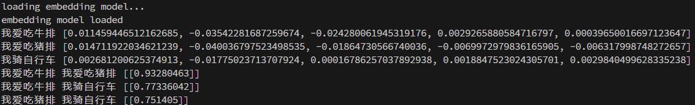
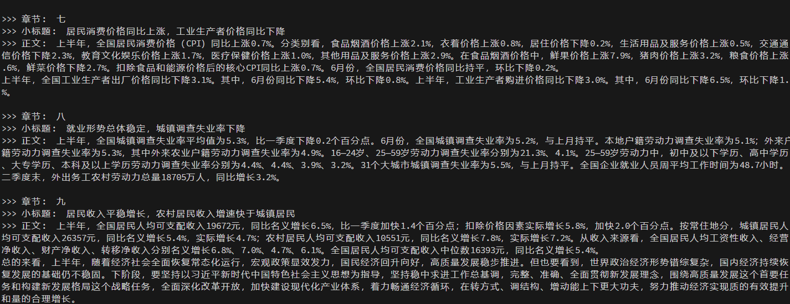
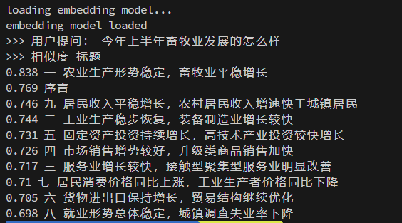
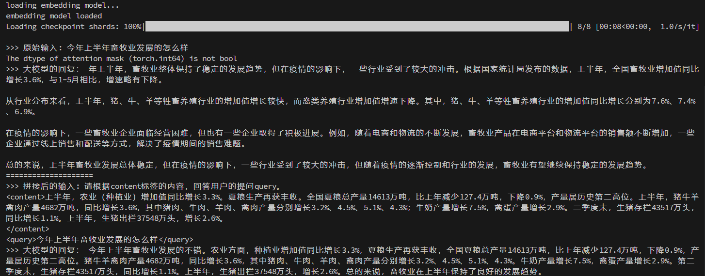

# 🚀langchain本地大模型应用实践🚀
本项目拆解了一个基于[🦜🔗LangChain](https://www.langchain.com/)框架的**本地**大模型聊天APP
所有内容都有配套代码和注释，用自底向上的方式对APP的关键功能进行讲解，最后用搭积木的方式实现最终的APP。


硬件要求：
1. 🖥️ 显卡 ≥ 3090，目前实测 3090 和 4090 可以正常运行ChatGLM-6B
2. 🌐 网络情况良好，可以正常使用 huggingface 和 github

软件要求：
1. 操作系统：本项目在 Ubuntu 20.04.1 x86_64 (5.15.0-76-generic 内核) 系统下通过测试，其他系统的兼容性问题请提 issue
2. python：本项目在 python 3.10 下通过测试。注：目前（2023-10）官方已经不再支持 python 3.7及以前版本。参考：https://devguide.python.org/versions/

---

## 1. 运行本地大模型
**学习目标**：从huggingface上下载清华大学开源的大模型ChatGLM-6B，并使用huggingface的transformers三方库，在本地运行
**操作步骤**：
1. 自行寻找可以访问huggingface的网络工具，然后使用git clone下载ChatGLM-6B在huggingface网站上的仓库：https://huggingface.co/THUDM/chatglm2-6b。（注意使用ssh协议，http协议容易断）。
2. 根据下载的位置，修改`1.model_from_huggingface/huggingface_demo.py` 文件第7行的具体路径
3. 在终端依次执行下面代码
    ```python
    cd 1.model_from_huggingface
    pip install -r requirements.txt
    python huggingface_demo.py
    ```

## 2. 基于langchain实现与本地大模型对话
**学习目标**：以api服务的方式运行chatglm-6B，然后使用langchain框架，调用本地的api，实现大模型对话功能
**操作步骤**：
1. 先开启一个终端，依次执行以下代码，启动api服务
    ```python
    cd 2.langchain_demo
    pip install -r requirements.txt
    python llm_api_server.py
    ```
2. 再开启另一个终端，依次执行以下代码：
    ```python
    cd 2.langchain_demo
    python langchain_demo.py
    ```

## 3. 文本向量化（embedding）和文本相似度
**学习目标**：掌握把文本转换成一组浮点数向量的过程，并且计算两个句子的向量相似度。后续基于pdf的本地大模型问答会用到。
**操作步骤**：
1. 下载智源研究院的embedding模型：https://huggingface.co/BAAI/bge-large-zh
号称目前中文最强，针对聊天场景有优化，详情参考官方微信公号文章：https://mp.weixin.qq.com/s/J8mG-J5KLkkWr6fQnkscZw

    > 下载时建议使用ssh方式，并加上`--depth 1`命令行选项，避免拷贝全量git历史记录加速下载。如果服务器的网络不好，还是下载失败，建议先使用可以上网的机器下载好，再用ftp软件比如filezilla传到服务器上。
    `
    git clone --depth 1 git@hf.co:BAAI/bge-large-zh /share/public/huggingface_cache/BAAI/bge-large-zh
    `

2. 在终端依次执行下列代码，观察输出：
    ```python
    cd 3.embedding_and_similarity
    pip install -r requirements.txt
    python embedding_and_similarity.py
    ```
    输出每句话的向量前5个值，以及两两之间的cos相似度：
    


## 4. 根据本地文件内容，和大模型对话

**学习目标**：将`doc_example.txt`的内容处理成langchain支持的文章片段，然后计算每个片段的标题的词向量（embedding），最后根据聊天内容，匹配最相关的片段，调用本地的大模型实现和文档对话。

**操作步骤**：
1. 文档内容的预处理，在终端依次执行以下代码，观察输出：
    ```python
    cd 4.chat_with_doc
    pip install -r requirements.txt
    python _1_doc_preprocess.py
    ```
    输出预处理后的分段内容：
    

2. 根据用户提问，匹配最接近的片段
    ```python
    python _2_match_query.py
    ```
    从输出可以看到，根据向量相似度，正确匹配到了第一章节
    
3. 根据匹配到的片段标题，把相关的正文拼接到大模型的输入，喂给大模型，获得回复
    ```python
    python _3_chat_with_doc.py
    ```
    ====分割线上方是没有拼接本地文档片段的回复，下方是拼接后的回复，可以看到，回复的准确率显著提高！
    


---

### 拓展阅读
1. 一个使用langchain框架，有前端页面，能够进行本地文档问答，web搜索问答，知识库管理功能的智能聊天系统： https://github.com/chatchat-space/Langchain-Chatchat